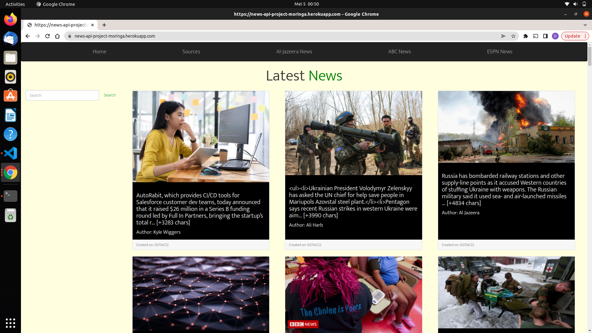

# News Api
## BY DOYO ABDIKADIR DOYO

## Description
### In context, your parents are busy workers and they get home really late. They always miss the news and they are very frustrated since they can't keep up with current affairs. As a developer i used my skills and prowess to remedy this problem. This is an application that will help them list and preview news articles from various sources.  

## Screenshots
Home Page

Sources Page

## Setup Instructions
### Clone or download and unzip the repository from github, https://github.com/Doyo54/Python-flask-week-2-IP. Then to run the application, open the cloned file in terminal and run the command:
-  python3 run.py

## Technologies Used
- Python3.9

## Known Bugs
No known bugs

## Copyright and license information
### The app is open source and in compliance with MIT License Copyright (c) 2022 {Doyo Abdikadir Doyo}
